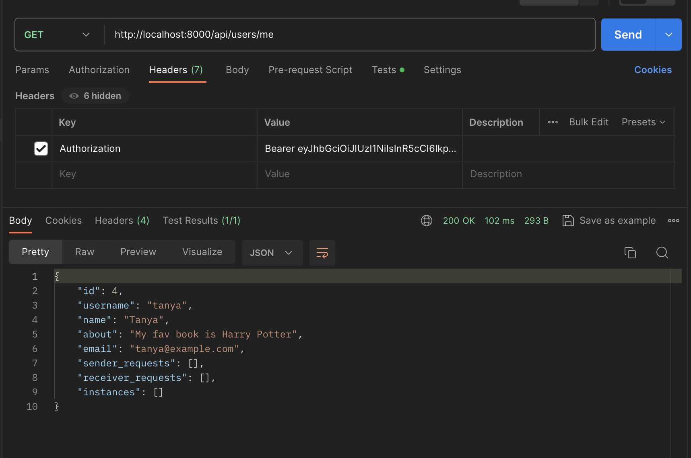

# Models
## Book instance
```
class BookInstanceBase(SQLModel):
    book_id: Optional[int] = Field(default=None, foreign_key="book.id")
    date: datetime.datetime
    publisher: str
    features: str


class BookInstance(BookInstanceBase, table=True):
    id: int = Field(default=None, primary_key=True)
    owner_id: Optional[int] = Field(default=None, foreign_key="user.id")
    requests: Optional[List["BookExchange"]] = Relationship(
        back_populates="book_instance",
        sa_relationship_kwargs=dict(foreign_keys="[BookExchange.book_instance_id]"),
    )
    book: Optional["Book"] = Relationship(back_populates="instances")
    owner: Optional["User"] = Relationship(back_populates="instances")


class BookInstanceRead(BookInstanceBase):
    id: int
    owner_id: int


class BookInstanceWithBook(BookInstanceRead):
    book: "BookRead" = None


class BookInstanceReadFull(BookInstanceWithBook):
    requests: list["BookExchangeRead"] = []
    owner: "UserBase" = None

```
## Author
```
class AuthorBase(SQLModel):
    name: str
    bio: str


class Author(AuthorBase, table=True):
    id: int = Field(default=None, primary_key=True)
    books: Optional[List["Book"]] = Relationship(back_populates="author")


class AuthorRead(AuthorBase):
    id: int


class AuthorReadFull(AuthorRead):
    books: list["BookRead"] = []
```
## Book
```
class BookBase(SQLModel):
    title: str
    description: str
    author_id: Optional[int] = Field(default=None, foreign_key="author.id")


class Book(BookBase, table=True):
    id: int = Field(default=None, primary_key=True)
    author: Optional[Author] = Relationship(back_populates="books")
    owners: Optional[List["User"]] = Relationship(back_populates="books", link_model=BookInstance)
    instances: Optional[List["BookInstance"]] = Relationship(back_populates="book")


class BookRead(BookBase):
    id: int


class BookReadFull(BookRead):
    author: AuthorRead = None
    owners: list["UserBase"] = []
    instances: list["BookInstanceRead"] = []
```
## User
```
class UserBase(SQLModel):
    id: int = Field(primary_key=True)
    username: str = Field(index=True)
    name: str
    about: str
    email: EmailStr = Field(unique=True, index=True, sa_type=AutoString)


class User(UserBase, table=True):
    password: str = Field(max_length=256, min_length=6)
    created_at: datetime.datetime = datetime.datetime.now()
    books: Optional[List["Book"]] = Relationship(back_populates="owners", link_model=BookInstance)
    sender_requests: Optional[List["BookExchange"]] = Relationship(
        back_populates="sender",
        sa_relationship_kwargs=dict(foreign_keys="[BookExchange.sender_id]"),
    )
    receiver_requests: Optional[List["BookExchange"]] = Relationship(
        back_populates="receiver",
        sa_relationship_kwargs=dict(foreign_keys="[BookExchange.receiver_id]"),
    )
    instances: Optional[List["BookInstance"]] = Relationship(back_populates="owner")


class UserReadFull(UserBase):
    sender_requests:  list["BookExchangeRead"] = []
    receiver_requests:  list["BookExchangeRead"] = []
    instances: list["BookInstanceWithBook"] = []


class UserInput(SQLModel):
    name: str
    about: str
    username: str
    password: str = Field(max_length=256, min_length=6)
    password2: str
    email: EmailStr = Field(unique=True, index=True, sa_type=AutoString)

    @validator('password2')
    def password_match(cls, v, values, **kwargs):
        if 'password' in values and v != values['password']:
            raise ValueError('passwords don\'t match')
        return v


class UserLogin(SQLModel):
    username: str
    password: str


class UserPassword(SQLModel):
    old_password: str
    new_password: str


```
## Book exchange
```
class BookExchangeBase(SQLModel):
    book_instance_id: Optional[int] = Field(default=None, foreign_key="bookinstance.id")
    status: ExchangeStatus
    date_start: datetime.datetime
    date_end: datetime.datetime


class BookExchange(BookExchangeBase, table=True):
    id: int = Field(default=None, primary_key=True)
    sender_id: Optional[int] = Field(default=None, foreign_key="user.id")
    receiver_id: Optional[int] = Field(default=None, foreign_key="user.id")

    sender: Optional["User"] = Relationship(
        back_populates="sender_requests",
        sa_relationship_kwargs=dict(foreign_keys="[BookExchange.sender_id]"),
    )
    receiver: Optional["User"] = Relationship(
        back_populates="receiver_requests",
        sa_relationship_kwargs=dict(foreign_keys="[BookExchange.receiver_id]"),
    )
    book_instance: Optional["BookInstance"] = Relationship(
        back_populates="requests",
        sa_relationship_kwargs=dict(foreign_keys="[BookExchange.book_instance_id]"),
    )


class BookExchangeChangeStatus(SQLModel):
    status: ExchangeStatus


class BookExchangeRead(BookExchangeBase):
    id: int
    sender_id: int
    receiver_id: int


class BookExchangeReadFull(BookExchangeRead):
    sender: "UserBase" = None
    receiver: "UserBase" = None
    book_instance: "BookInstanceWithBook" = None

```
# Endpointes

## user
```
from fastapi import FastAPI, HTTPException, Depends, APIRouter
from psycopg2._psycopg import List
from sqlmodel import select
from models import User, UserInput, UserBase, UserLogin, UserReadFull, UserPassword
from auth.auth import AuthHandler
from database.conn import get_session

user_router = APIRouter()
auth_handler = AuthHandler()


@user_router.post('/register', status_code=201, description='Register new user')
def register(user: UserInput, session=Depends(get_session)):
    users = session.exec(select(User)).all()
    if any(x.username == user.username for x in users):
        raise HTTPException(status_code=400, detail='Username is taken')
    if any(x.email == user.email for x in users):
        raise HTTPException(status_code=400, detail='Email is taken')
    hashed_pwd = auth_handler.get_password_hash(user.password)
    user = User(username=user.username, password=hashed_pwd, email=user.email, name=user.name, about=user.about)
    session.add(user)
    session.commit()
    return {"status": 201, "message": "New user is created!"}


@user_router.get('/users')
def get_users(session=Depends(get_session)) -> list[User]:
    users = session.exec(select(User)).all()
    return users


@user_router.post('/login')
def login(user: UserLogin, session=Depends(get_session)):
    user_found = session.exec(select(User).where(User.username == user.username)).first()
    if not user_found:
        raise HTTPException(status_code=401, detail='Invalid username or password')
    verified = auth_handler.verify_password(user.password, user_found.password)
    if not verified:
        raise HTTPException(status_code=401, detail='Invalid username or password')
    token = auth_handler.encode_token(user_found.username)
    return {'token': token}


@user_router.get('/users/me')
def get_current_user(user: User = Depends(auth_handler.get_current_user)) -> UserReadFull:
    return user


@user_router.patch('/users/me/change-password')
def change_password(passwords: UserPassword, user: User = Depends(auth_handler.get_current_user),
                    session=Depends(get_session)):
    # Проверяем, что текущий пароль пользователя верный
    if not auth_handler.verify_password(passwords.old_password, user.password):
        raise HTTPException(status_code=400, detail="Current password is incorrect")

    # Хешируем новый пароль
    hashed_new_password = auth_handler.get_password_hash(passwords.new_password)

    # Обновляем пароль пользователя в базе данных
    user.password = hashed_new_password
    session.add(user)
    session.commit()

    return {"message": "Password updated successfully"}


@user_router.get("/users/{user_id}")
def get_user_by_id(user_id: int, session=Depends(get_session)) -> UserReadFull:
    user = session.get(User, user_id)
    if not user:
        raise HTTPException(status_code=404, detail="User not found")
    return user

```
#### Register


#### Login


#### Get current user


#### Get user by id


#### Get all users


#### Change password


## Database connection
```
from sqlmodel import SQLModel, Session, create_engine
import os
from dotenv import load_dotenv

load_dotenv()
db_url = os.getenv("DB_URL")
engine = create_engine(db_url, echo=True)


def init_db():
    SQLModel.metadata.create_all(engine)


def get_session():
    with Session(engine) as session:
        yield session

```

## Хэширование паролей, кодирование и декодирование JWT, проверка аунтефикации, получение текущего пользователя

```
import datetime
from fastapi import Security, HTTPException, Depends
from fastapi.security import HTTPBearer, HTTPAuthorizationCredentials
from passlib.context import CryptContext
import jwt
from starlette import status
from database.conn import get_session
from models import User
from sqlmodel import select


class AuthHandler:
    security = HTTPBearer()
    pwd_context = CryptContext(schemes=['bcrypt'])
    SECRET_KEY = 'SECRET_KEY'

    def get_password_hash(self, password):
        return self.pwd_context.hash(password)

    def verify_password(self, pwd, hashed_pwd):
        return self.pwd_context.verify(pwd, hashed_pwd)

    def encode_token(self, username):
        payload = {
            'exp': datetime.datetime.utcnow() + datetime.timedelta(hours=8),
            'iat': datetime.datetime.utcnow(),
            'sub': username
        }
        return jwt.encode(payload, self.SECRET_KEY, algorithm='HS256')

    def decode_token(self, token):
        try:
            payload = jwt.decode(token, self.SECRET_KEY, algorithms=['HS256'])
            return payload['sub']
        except jwt.ExpiredSignatureError:
            raise HTTPException(status_code=401, detail='Expired signature')
        except jwt.InvalidTokenError:
            raise HTTPException(status_code=401, detail='Invalid token')

    def auth_wrapper(self, auth: HTTPAuthorizationCredentials = Security(security)):
        return self.decode_token(auth.credentials)

    def get_current_user(self, auth: HTTPAuthorizationCredentials = Security(security), session=Depends(get_session)):
        credentials_exception = HTTPException(
            status_code=status.HTTP_401_UNAUTHORIZED,
            detail='Could not validate credentials'
        )
        username = self.decode_token(auth.credentials)  # Получить имя пользователя из токена
        if username is None:
            raise credentials_exception
        user = session.exec(select(User).where(User.username == username)).first()  # Найти пользователя по имени
        if user is None:
            raise credentials_exception
        return user

```
