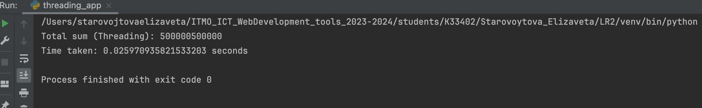

# Task 1

## Описание
Напишите три различных программы на Python, использующие каждый из подходов: threading, multiprocessing и async. Каждая программа должна решать считать сумму всех чисел от 1 до 1000000. Разделите вычисления на несколько параллельных задач для ускорения выполнения.

### Async
```
import asyncio
import time


async def calculate_partial_sum(start, end):
    partial_sum = sum(range(start, end))
    return partial_sum


async def calculate_sum():
    num_tasks = 5
    chunk_size = 1000000 // num_tasks

    tasks = []
    start_time = time.time()
    for i in range(num_tasks):
        start = i * chunk_size + 1
        end = (i + 1) * chunk_size + 1 if i < num_tasks - 1 else 1000001
        task = asyncio.create_task(calculate_partial_sum(start, end))
        tasks.append(task)

    partial_sums = await asyncio.gather(*tasks)
    total_sum = sum(partial_sums)

    end_time = time.time()
    print("Total sum (Async):", total_sum)
    print("Time taken:", end_time - start_time, "seconds")


if __name__ == "__main__":
    asyncio.run(calculate_sum())

```

### Multiprocessing
```
import multiprocessing
import time


def calculate_partial_sum(start, end, result):
    partial_sum = sum(range(start, end))
    result.put(partial_sum)


def calculate_sum():
    num_processes = 2
    results = multiprocessing.Queue()

    processes = []
    start_time = time.time()
    chunk_size = 1000000 // num_processes
    for i in range(num_processes):
        start = i * chunk_size + 1
        end = (i + 1) * chunk_size + 1 if i < num_processes - 1 else 1000001
        process = multiprocessing.Process(target=calculate_partial_sum, args=(start, end, results))
        processes.append(process)
        process.start()

    for process in processes:
        process.join()

    end_time = time.time()
    total_sum = 0
    while not results.empty():
        total_sum += results.get()

    print("Total sum (Multiprocessing):", total_sum)
    print("Time taken:", end_time - start_time, "seconds")


if __name__ == "__main__":
    calculate_sum()

```

### Threading
```
import threading
import time


def calculate_partial_sum(start, end, result):
    partial_sum = sum(range(start, end))
    result.append(partial_sum)


def calculate_sum():
    num_threads = 4
    results = []
    start_time = time.time()
    threads = []
    chunk_size = 1000000 // num_threads
    for i in range(num_threads):
        start = i * chunk_size + 1
        end = (i + 1) * chunk_size + 1 if i < num_threads - 1 else 1000001
        thread = threading.Thread(target=calculate_partial_sum, args=(start, end, results))
        threads.append(thread)
        thread.start()


    for thread in threads:
        thread.join()

    end_time = time.time()
    total_sum = sum(results)
    print("Total sum (Threading):", total_sum)
    print("Time taken:", end_time - start_time, "seconds")


if __name__ == "__main__":
    calculate_sum()

```


### Результаты

По времени выполнения сильно проигрывает multiprocessing (из-за потраченного на создание потоков ресурсов), async и threading отработали почти одинаково.



